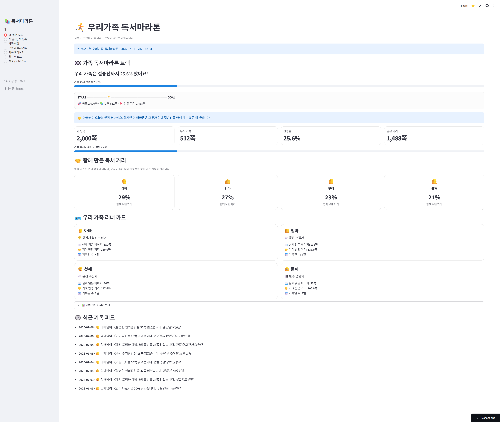
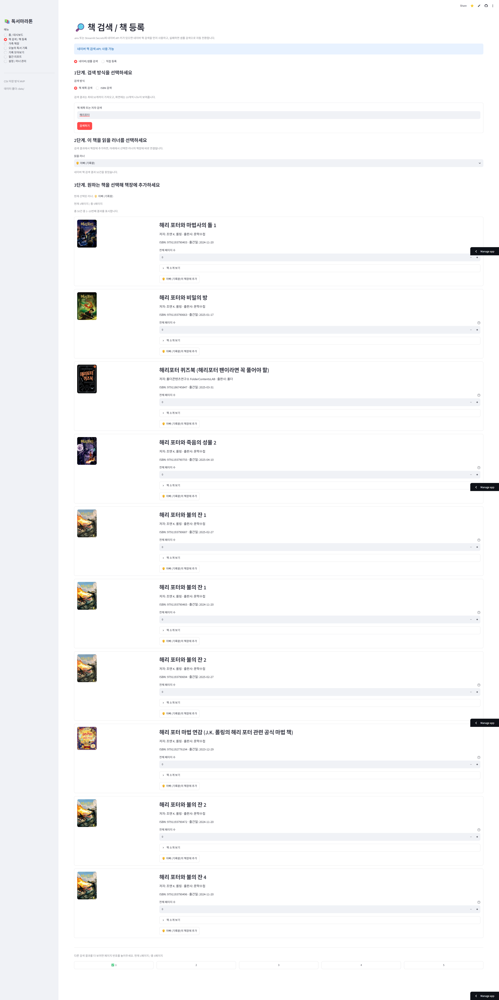
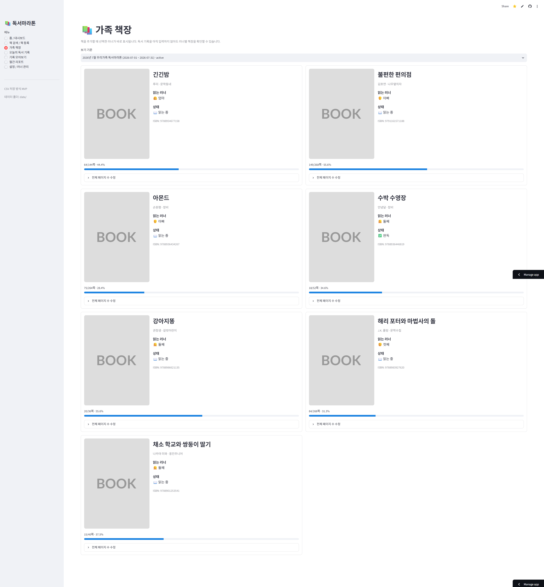
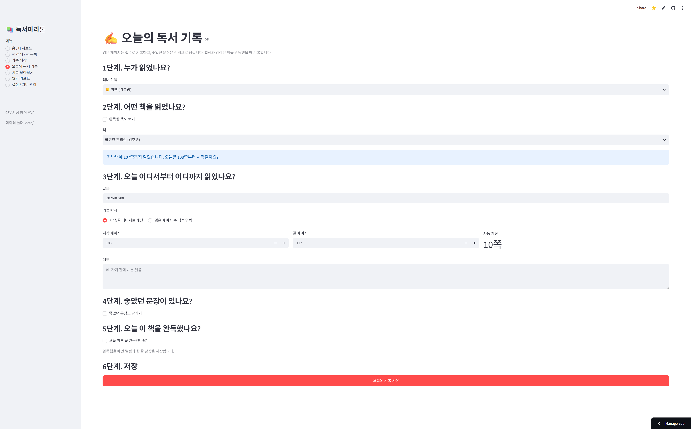
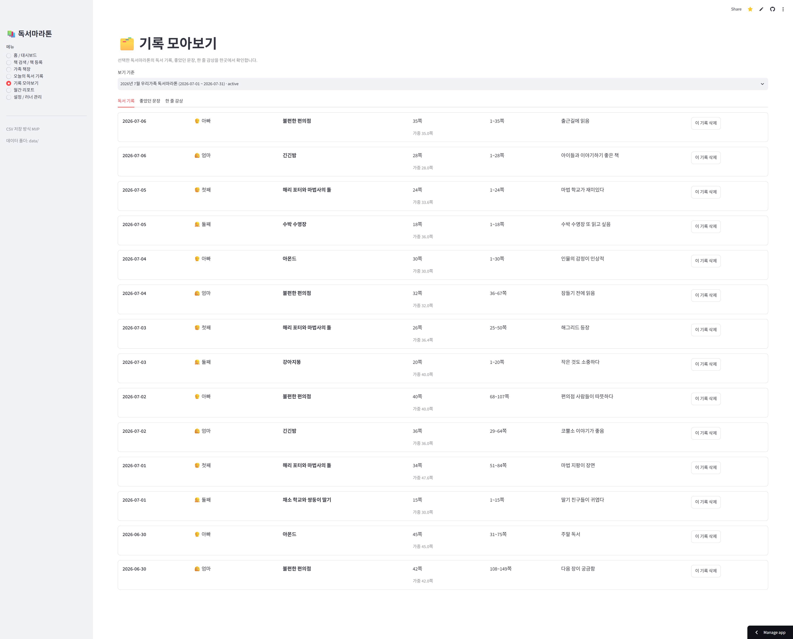
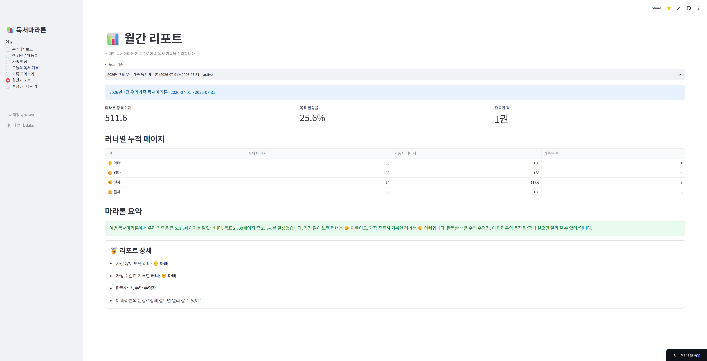
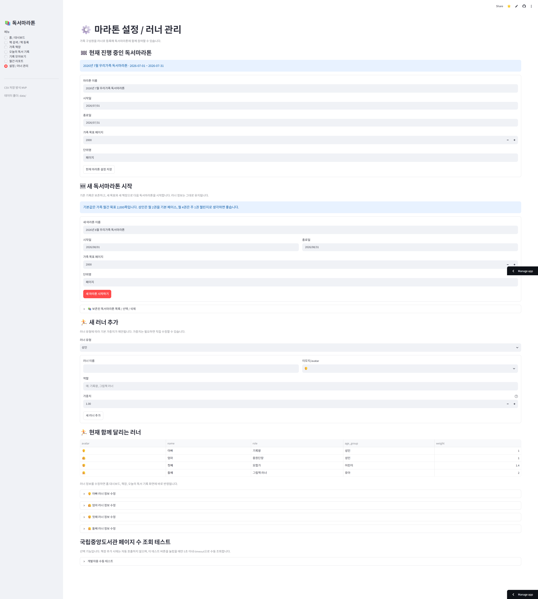

# 🏁 우리가족 독서마라톤

가족이 함께 읽은 책과 페이지 수, 좋았던 문장, 완독 감상을 기록하고  
가족 전체의 독서 목표 달성 과정을 마라톤처럼 시각화하는 Streamlit 웹앱입니다.

> 책을 많이 읽은 사람을 가리는 경쟁이 아니라,  
> 가족이 함께 하나의 결승선을 향해 달리는 **협동 독서마라톤**을 목표로 합니다.

---

## 🔗 바로가기

- **Streamlit 앱 실행하기:** https://family-reading-marathon.streamlit.app/
- **GitHub Pages 소개 페이지:** https://goodlawyer23-jpg.github.io/family-reading-marathon/
- **GitHub 저장소:** https://github.com/goodlawyer23-jpg/family-reading-marathon
- **프로젝트 발표 자료:** [`docs/PRESENTATION_OUTLINE.md`](docs/PRESENTATION_OUTLINE.md)
- **프로젝트 브리프:** [`docs/PROJECT_BRIEF.md`](docs/PROJECT_BRIEF.md)
- **MVP 명세:** [`docs/MVP_SPEC.md`](docs/MVP_SPEC.md)

---

## 1. 서비스 한 줄 소개

**우리가족 독서마라톤**은 네이버 책 검색 API로 책 정보를 불러오고, 가족 구성원이 읽은 페이지와 감상, 좋았던 문장을 기록하며, 가족 전체의 독서 목표 달성률을 시각적으로 확인할 수 있는 가족 독서 기록 웹앱입니다.

---

## 2. 프로젝트 개요 / 문제 정의

가족이 함께 독서 습관을 만들고 싶어도 실제로는 다음과 같은 어려움이 있습니다.

- 각자 어떤 책을 읽고 있는지 한눈에 보기 어렵습니다.
- 책을 어디까지 읽었는지 지속적으로 기록하기 어렵습니다.
- 아이들은 긴 독후감을 쓰기 부담스러워합니다.
- 가족 전체가 한 달 동안 얼마나 읽었는지 확인하기 어렵습니다.
- 독서가 개인 활동으로만 남고, 함께 응원하는 구조가 부족합니다.

이 프로젝트는 이러한 문제를 해결하기 위해 만들었습니다.

가족 구성원을 **러너**로 등록하고, 각자 읽는 책을 책장에 담은 뒤, 오늘 읽은 페이지와 좋았던 문장, 완독 감상을 기록합니다. 홈 대시보드에서는 가족 전체가 목표 페이지까지 얼마나 왔는지 마라톤 트랙 형태로 보여줍니다.

---

## 3. 핵심 콘셉트: 협동 독서마라톤

이 앱은 가족 구성원끼리 순위를 경쟁하는 서비스가 아닙니다.

가족 전체가 하나의 목표를 향해 함께 달리는 구조입니다.

- 가족 목표 페이지를 설정합니다.
- 각 러너가 읽은 페이지가 가족 전체 독서 거리로 누적됩니다.
- 어린이와 유아도 독서 난이도에 따라 가중치를 반영할 수 있습니다.
- 한 독서마라톤이 끝나면 기록은 보존하고 새 마라톤을 시작할 수 있습니다.
- 보존된 마라톤은 다시 선택하거나 삭제할 수 있습니다.

---

## 4. 주요 기능

### 홈 / 대시보드

- 가족 전체 독서마라톤 진행률 표시
- 목표 페이지, 누적 페이지, 남은 거리 표시
- 마라톤 트랙형 진행률 UI
- 러너별 협동 기여도 표시
- 규칙 기반 응원 문구 표시
- 최근 독서 기록 피드 표시

### 책 검색 / 책 등록

- 네이버 책 검색 API 연동
- 책 제목 검색
- ISBN 검색
- 검색어 입력 후 Enter 검색 지원
- 검색 결과 최대 50개 조회
- 10개 단위 페이지네이션
- 페이지 버튼 클릭 시 검색 결과 상단 이동
- 책 소개 expander 표시
- 책장 추가 시 러너 선택
- 전체 페이지 수 직접 입력
- 같은 러너의 중복 책장 추가 방지
- API 실패 시 샘플 검색 또는 직접 등록 안내

### 가족 책장

- 러너별 책장 카드 표시
- 책 표지, 제목, 저자, 출판사, ISBN 표시
- 읽는 러너 표시
- 읽는 중 / 완독 상태 표시
- 책별 진행률 표시
- 전체 페이지 수 수정
- 기록이 없는 책의 읽는 러너 변경
- 기록이 없는 책을 책장에서 제거
- 연결 기록이 있는 책은 데이터 보호를 위해 제거·러너 변경 제한

### 오늘의 독서 기록

- 러너 선택
- 현재 마라톤에서 해당 러너의 책만 표시
- 시작 페이지 / 끝 페이지 입력 시 읽은 페이지 수 자동 계산
- 책 전체 페이지 수 초과 입력 방지
- 최대 입력 가능 페이지 안내
- 읽은 페이지 수 직접 입력 방식 지원
- 이전 기록 기준 다음 시작 페이지 자동 제안
- 좋았던 문장 선택 입력
- 완독 시 달 이모지 평점과 한 줄 감상 저장
- 저장 후 입력 폼 초기화

### 달 이모지 평점

완독 평점은 0.5점 단위로 저장하고, 아이들이 직관적으로 볼 수 있도록 달 이모지로 표시합니다.

```text
0.5점  🌗🌑🌑🌑🌑
1.0점  🌕🌑🌑🌑🌑
2.5점  🌕🌕🌗🌑🌑
3.5점  🌕🌕🌕🌗🌑
4.5점  🌕🌕🌕🌕🌗
5.0점  🌕🌕🌕🌕🌕
```

실제 데이터는 `0.5`부터 `5.0`까지 float 값으로 저장합니다.

### 기록 모아보기

- 독서 기록 목록 조회
- 좋았던 문장 목록 조회
- 완독 감상과 달 평점 조회
- 독서 기록 삭제 전 확인
- 좋았던 문장 삭제 전 확인
- 완독 감상 삭제 전 확인
- 마라톤별 기록 조회

### 월간 리포트

- 선택한 독서마라톤 기준 리포트 생성
- 총 읽은 페이지
- 목표 달성률
- 러너별 누적 페이지
- 가장 많이 기여한 러너
- 가장 꾸준히 기록한 러너
- 완독한 책
- 이달의 문장
- 규칙 기반 자동 요약문

### 설정 / 러너 관리

- 러너 추가
- 러너 정보 수정
- 러너 삭제
- 러너 유형 설정
  - 성인
  - 청소년
  - 어린이
  - 유아
- 러너별 가중치 설정
- 현재 마라톤 설정 수정
- 새 독서마라톤 시작
- 보존된 독서마라톤 선택 / 삭제
- 관리자 모드로 쓰기·삭제·초기화 기능 보호
- 개발/테스트용 샘플 데이터 도구

---

## 5. 기술 스택

- Python
- Streamlit
- pandas
- requests
- Plotly
- python-dotenv
- Supabase PostgreSQL
- CSV 선택 백엔드 및 백업
- GitHub
- GitHub Pages
- Streamlit Community Cloud

---

## 6. 데이터 저장 방식

현재 운영 데이터는 **Supabase PostgreSQL**에 저장합니다.

GitHub 코드가 업데이트되거나 Streamlit Community Cloud가 재배포되어도 다음 데이터가 유지됩니다.

- 독서마라톤
- 러너
- 가족 책장
- 독서 기록
- 좋았던 문장
- 완독 감상 및 평점

CSV 저장소도 로컬 테스트, 데이터 백업, 장애 대응을 위해 유지합니다.

환경변수 `STORAGE_BACKEND`로 저장소를 선택합니다.

```env
STORAGE_BACKEND=supabase
```

또는:

```env
STORAGE_BACKEND=csv
```

### Supabase 테이블

```text
marathons
family_members
books
reading_logs
quotes
reviews
```

### CSV 파일

```text
data/
  settings.csv
  family_members.csv
  books.csv
  reading_logs.csv
  quotes.csv
  reviews.csv
```

CSV 백엔드에서는 파일이 없을 경우 필요한 컬럼 구조로 자동 생성합니다.

---

## 7. 프로젝트 구조

```text
family-reading-marathon/
  app.py
  storage.py
  requirements.txt
  README.md
  .gitignore

  test_storage.py
  test_storage_crud.py
  test_supabase.py
  migrate_csv_to_supabase.py
  test_nlk_api.py

  data/
    books.csv
    family_members.csv
    reading_logs.csv
    quotes.csv
    reviews.csv
    settings.csv

  sample_data/
    sample_books.csv

  docs/
    index.html
    PROJECT_BRIEF.md
    MVP_SPEC.md
    DEV_LOG.md
    PRESENTATION_OUTLINE.md
    images/
      home_dashboard.png
      book_search.png
      library.png
      today_log.png
      records.png
      monthly_report.png
      runner_settings.png
```

---

## 8. 로컬 실행 방법

Windows 기준입니다.

```bash
python -m venv .venv
.venv\Scripts\activate
pip install -r requirements.txt
streamlit run app.py
```

브라우저가 자동으로 열리지 않으면 아래 주소로 접속합니다.

```text
http://localhost:8501
```

---

## 9. 로컬 환경변수 설정

프로젝트 루트에 `.env` 파일을 만들고 필요한 값을 입력합니다.

```env
STORAGE_BACKEND=supabase

SUPABASE_URL=https://프로젝트주소.supabase.co
SUPABASE_KEY=서버용_SECRET_KEY

NAVER_CLIENT_ID=발급받은_CLIENT_ID
NAVER_CLIENT_SECRET=발급받은_CLIENT_SECRET

ADMIN_PASSWORD=원하는_관리자_비밀번호
```

민감정보가 포함된 `.env`는 GitHub에 올리지 않습니다.

---

## 10. Streamlit Community Cloud 배포

배포 주소:

https://family-reading-marathon.streamlit.app/

Streamlit Community Cloud에 배포된 공개 앱입니다. 일부 자동 평가 도구에서는 Streamlit 인증 리다이렉트가 발생할 수 있으므로, 접속이 안 될 경우 일반 브라우저에서 직접 열어 확인해 주세요.

### Streamlit Secrets

Streamlit Community Cloud의 앱 설정에서 **Secrets**에 아래 값을 등록합니다.

```toml
STORAGE_BACKEND = "supabase"

SUPABASE_URL = "https://프로젝트주소.supabase.co"
SUPABASE_KEY = "서버용_SECRET_KEY"

NAVER_CLIENT_ID = "발급받은_CLIENT_ID"
NAVER_CLIENT_SECRET = "발급받은_CLIENT_SECRET"

ADMIN_PASSWORD = "원하는_관리자_비밀번호"
```

`SUPABASE_KEY`는 브라우저나 GitHub에 노출하지 않고 Streamlit 서버의 Secrets에서만 사용합니다.

---

## 11. 관리자 모드

공개 앱에서는 읽기 화면을 누구나 볼 수 있지만, 데이터 변경 기능은 관리자 모드에서만 사용할 수 있습니다.

관리자 모드가 아닐 때도 다음 화면은 읽기 전용으로 확인할 수 있습니다.

- 홈 / 대시보드
- 가족 책장
- 기록 모아보기
- 월간 리포트

관리자 모드가 아닐 때 제한되는 기능:

- 책장에 책 추가
- 오늘의 독서 기록 저장
- 기록 삭제
- 가족 책장 관리
- 러너 추가 / 수정 / 삭제
- 마라톤 설정 변경 / 시작 / 삭제
- 샘플 데이터 생성 / 전체 초기화

---

## 12. API 사용 방식

### 네이버 책 검색 API

네이버 책 검색 API를 사용해 다음 정보를 가져옵니다.

- 책 제목
- 저자
- 출판사
- ISBN
- 표지 이미지
- 책 소개
- 출간일

책 제목 검색과 ISBN 검색을 지원합니다.

### API 키가 없는 경우

네이버 API 키가 없거나 호출이 실패해도 앱이 중단되지 않습니다.

- 개발/테스트용 샘플 검색
- 책 직접 등록

방식으로 책장 등록을 계속할 수 있습니다.

### 국립중앙도서관 API

국립중앙도서관 API는 네트워크 환경에서 응답 지연이 확인되어 책장 추가 시 자동 호출하지 않습니다. 개발자용 수동 테스트 기능만 유지합니다.

### 알라딘 API

알라딘 API는 응답 속도와 안정성 검증 단계에서 본 앱 연결을 보류했습니다. 현재 운영 앱에서는 사용하지 않습니다.

---

## 13. 추천 사용 흐름

### Step 1. 러너 등록

- 설정 / 러너 관리로 이동
- 이름, 유형, 이모지, 가중치 등록

### Step 2. 마라톤 설정

- 현재 마라톤 이름과 기간 확인
- 가족 목표 페이지 설정
- 필요하면 새 마라톤 시작

### Step 3. 책 검색 및 책장 추가

- 책 제목 또는 ISBN 검색
- 전체 페이지 수 입력
- 읽을 러너 선택
- 책장에 추가

### Step 4. 오늘의 독서 기록

- 러너와 책 선택
- 시작 / 끝 페이지 입력
- 좋았던 문장 선택 입력
- 완독 시 달 평점과 감상 저장

### Step 5. 기록과 리포트 확인

- 기록 모아보기
- 가족 책장 진행률
- 홈 마라톤 트랙
- 월간 리포트 확인

---

## 14. GitHub Pages 소개 페이지

정적 소개 페이지:

https://goodlawyer23-jpg.github.io/family-reading-marathon/

`docs/index.html`을 기준으로 서비스 목적, 주요 기능, 데모 시나리오, 화면 캡처를 제공합니다.

GitHub Pages 설정:

1. GitHub 저장소의 **Settings**로 이동합니다.
2. **Pages**를 선택합니다.
3. Source를 **Deploy from a branch**로 설정합니다.
4. Branch는 `main`, 폴더는 `/docs`로 설정합니다.
5. 저장 후 배포 주소를 확인합니다.

---

## 15. 화면 캡처

### 홈 / 대시보드



### 책 검색 / 책 등록



### 가족 책장



### 오늘의 독서 기록



### 기록 모아보기



### 월간 리포트



### 설정 / 러너 관리



---

## 16. 저장소 테스트

CSV와 Supabase의 데이터가 같은지 확인합니다.

```bash
python test_storage.py
```

저장소 CRUD 메서드를 확인합니다.

```bash
python test_storage_crud.py
```

문법 검사:

```bash
python -m py_compile app.py storage.py test_storage.py test_storage_crud.py
```

---

## 17. 데이터 마이그레이션과 백업

기존 CSV 데이터를 Supabase로 옮길 때는 dry-run을 먼저 실행합니다.

```bash
python migrate_csv_to_supabase.py
```

실제 반영:

```bash
python migrate_csv_to_supabase.py --apply
```

마이그레이션 전 CSV는 `backup/` 폴더에 별도로 보관합니다.

---

## 18. MVP 구현 범위

포함된 기능:

- 네이버 책 검색
- 가족 책장
- 러너 관리
- 독서 기록
- 좋았던 문장
- 완독 감상
- 달 이모지 평점
- 월간 리포트
- 새 독서마라톤 시작
- 보존된 마라톤 선택 / 삭제
- Supabase 영구 저장
- CSV 선택 백엔드
- 관리자 모드
- GitHub Pages 소개 페이지

제외한 기능:

- 회원가입
- 가족별 계정 분리
- 결제
- SNS 공유
- OCR
- 바코드 스캔
- 모바일 앱
- 실제 AI API 연동
- 복잡한 권한 관리

---

## 19. 향후 확장 방향

### 데이터 및 보안

- Supabase Auth
- 여러 가족을 지원하는 `family_id`
- 가족별 RLS 정책
- 여러 테이블 작업의 PostgreSQL RPC 트랜잭션
- 정기 백업

### 게임화

- 배지 시스템
- 가족 협동 미션
- 이벤트 기간 보너스
- 아이템 획득
- 완주 인증서
- 월간 독서 리포트 PDF

### 책 정보

- 베스트셀러 / 신간 추천
- 카테고리 큐레이션
- 안정적인 페이지 수 제공 API 검토

### AI

현재 MVP에서는 실제 AI API를 사용하지 않습니다.

향후 검토 기능:

- 가족 독서 리포트 자동 생성
- 아이 수준에 맞춘 독서 질문 추천
- 좋았던 문장 기반 대화 주제 추천
- 완독 감상 요약

---

## 20. 프로젝트의 차별점

이 프로젝트는 단순한 독서 기록장이 아니라, 가족이 함께 쓰는 협동형 독서마라톤입니다.

- 책을 검색해 쉽게 등록할 수 있습니다.
- 아이도 짧게 기록할 수 있습니다.
- 달 이모지 평점으로 완독 감상을 직관적으로 남길 수 있습니다.
- 가족 전체 목표 달성률이 한눈에 보입니다.
- 기존 기록을 보존한 채 새 독서마라톤을 시작할 수 있습니다.
- GitHub와 Streamlit 재배포 후에도 Supabase에 데이터가 유지됩니다.
- CSV 저장소도 백업과 로컬 테스트용으로 유지합니다.
- 실제 가족이 바로 사용할 수 있는 작고 작동하는 MVP입니다.

---

## 21. 개발 목적

이 프로젝트의 목표는 거대한 플랫폼을 만드는 것이 아니라, 가족이 실제 생활에서 사용할 수 있는 작은 웹앱을 빠르게 만들고, 기능이 실제로 작동하는 MVP로 구현하는 것입니다.

> “우리 가족이 책을 더 즐겁게 읽고, 서로의 독서 여정을 확인할 수 있는가?”

이 질문을 기준으로 기능을 설계하고 구현했습니다.
